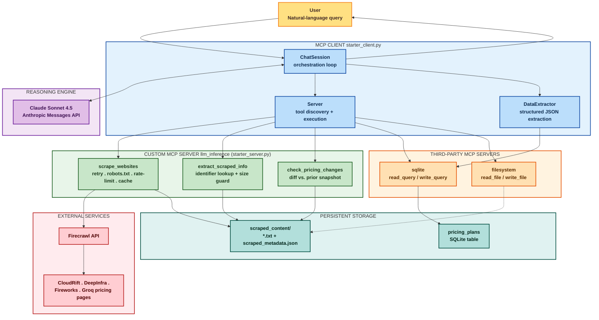

# MCP Pricing Intelligence

**An MCP-orchestrated AI system for automated LLM inference pricing intelligence, built on Claude Sonnet 4.5, Firecrawl, and the Model Context Protocol.**

Ask it a plain-English question like *"Compare CloudRift and DeepInfra's costs for DeepSeek V3"* and the agent will scrape the live pricing pages, extract the relevant numbers, store them in a durable SQLite record, and answer with a grounded, natural-language comparison, all without any hand-written per-provider parsing logic.

---

## Table of Contents

- [Overview](#overview)
- [Architecture](#architecture)
- [Features](#features)
- [Standout Enhancements](#standout-enhancements)
- [Project Structure](#project-structure)
- [Prerequisites](#prerequisites)
- [Installation](#installation)
- [Configuration](#configuration)
- [Running the Project](#running-the-project)
- [Example Queries](#example-queries)
- [MCP Tool Reference](#mcp-tool-reference)
- [Testing](#testing)
- [Troubleshooting](#troubleshooting)
- [Limitations](#limitations)
- [References](#references)

---

## Overview

The LLM inference market changes weekly: new providers, new models, new prices. Tracking that manually across a dozen pricing pages does not scale. This project turns that research task into a conversational agent.

A single Python client connects, over the Model Context Protocol, to three MCP servers at once:

1. A **custom scraper server** (this project) that retrieves, cleans, persists, and diffs provider pricing pages.
2. A **SQLite server** that gives the agent durable, queryable storage for every pricing figure it extracts.
3. A **filesystem server** that gives the agent scoped read/write access to the project directory.

Claude Sonnet 4.5 sits at the center of the loop, deciding which tools to call, in what order, and how to interpret their results, until it can give a final, evidence-backed answer.

---

## Architecture

The system follows a hub-and-spoke MCP architecture: the client is the orchestration hub, Claude is the reasoning engine, and each MCP server contributes a distinct capability. The diagram below groups every component by role, each group carries its own color palette, and arrows trace the actual data-science flow from a user's question through retrieval, extraction, storage, and back to an answer.



### How to read it

| Color group | Role |
|---|---|
| 🟡 **User** | Where the natural-language question enters and the final answer is printed |
| 🔵 **MCP Client** | `starter_client.py` — discovers tools across all servers, runs the tool-use loop, extracts structured data |
| 🟣 **Reasoning Engine** | Claude Sonnet 4.5, called via the Anthropic Messages API to plan and interpret every step |
| 🟢 **Custom MCP Server** | `starter_server.py` (`llm_inference`) — this project's three purpose-built pricing tools |
| 🟠 **Third-Party MCP Servers** | Off-the-shelf `sqlite` and `filesystem` servers, wired in with zero custom code |
| 🔴 **External Services** | Firecrawl (the scraping backend) and the live provider pricing pages themselves |
| 🟦 **Persistent Storage** | The on-disk scrape cache/metadata and the SQLite `pricing_plans` table, both durable across sessions |

### Request lifecycle

1. The user asks a question in the terminal client.
2. The client sends the question, plus the full tool catalog aggregated from all three MCP servers, to Claude.
3. Claude responds with either a final answer or a `tool_use` request.
4. The client resolves the requested tool to its owning server and executes it (with retries on transient failures).
5. The tool result is appended to the conversation and sent back to Claude.
6. Steps 3-5 repeat until Claude returns a text-only response.
7. A secondary extraction pass converts any pricing figures in the final answer into structured JSON and persists them to SQLite through the same tool-use mechanism, so every query grows a durable, queryable history.

---

## Features

- **Natural-language pricing research.** Ask about one provider, compare several, or ask what changed, all in plain English.
- **Three purpose-built MCP tools**: `scrape_websites`, `extract_scraped_info`, and `check_pricing_changes`.
- **Multi-server orchestration**: one client, three MCP servers (custom scraper, SQLite, filesystem), unified into a single tool catalog.
- **Durable memory**: every pricing figure the agent extracts is written to SQLite, so past research is queryable without re-scraping.
- **Transparent execution**: a live, timestamped terminal trace shows every reasoning step, tool call, and database write as it happens.

## Standout Enhancements

| # | Enhancement | Where |
|---|---|---|
| 1 | Retry/backoff, robots.txt-aware crawling, per-domain rate limiting, and URL dedup | `starter_server.py` |
| 2 | Time-based caching layer (24h TTL) with a `force` bypass | `starter_server.py` |
| 3 | `check_pricing_changes` pricing-change alert tool | `starter_server.py` |
| 4 | 22-test automated unit/smoke suite (fully mocked, no API key needed) | `test_server.py`, `test_client.py` |
| 5 | Streaming terminal UI (`THINKING` / `TOOL_CALL` / `TOOL_RESULT` / `DB` / `ANSWER`) | `starter_client.py` |

See [`STANDOUTS.md`](STANDOUTS.md) for full details, demo steps, and the three real production bugs that were found and fixed during hardening.

---

## Project Structure

```
project-Starter/
├── starter_server.py      # Custom MCP server: scrape_websites, extract_scraped_info, check_pricing_changes
├── starter_client.py      # MCP client: multi-server orchestration, tool-use loop, SQLite persistence
├── server_config.json     # MCP server definitions (llm_inference, sqlite, filesystem)
├── pyproject.toml         # Python dependencies (managed by uv)
├── uv.lock                # Locked dependency versions
├── test_server.py         # Server-side unit + smoke tests (14 tests)
├── test_client.py         # Client-side unit tests (8 tests)
├── .env.example            # Template for required API keys
├── README.md               # This file
├── RUNNING.md               # Full start-to-finish run instructions
└── STANDOUTS.md             # Standout-feature details and bugfix write-ups
```
Full report is in [`Agentic_Price_Analysis_Report.pdf`](Agentic_Price_Analysis_Report.pdf).
---

## Prerequisites

- **Python 3.10+**
- **[uv](https://docs.astral.sh/uv/getting-started/installation/)** for dependency and environment management
- **Node.js** (provides `npx`, used by the filesystem MCP server)
- An **Anthropic API key**
- A **Firecrawl API key** (free tier available at [firecrawl.dev](https://www.firecrawl.dev/signin))

---

## Installation

```bash
cd project-Starter
uv venv
source .venv/bin/activate      # Windows: .venv\Scripts\Activate.ps1
uv sync
```

## Configuration

```bash
cp .env.example .env
```

Edit `.env` with your real keys:

```
ANTHROPIC_API_KEY=sk-ant-...
FIRECRAWL_API_KEY=fc-...
```

`server_config.json` already points the `llm_inference` server at `starter_server.py`, and the `sqlite`/`filesystem` servers at their standard packages, no further changes are needed for a local run.

---

## Running the Project

```bash
uv run pytest test_server.py test_client.py -v   # optional: verify everything offline first
python starter_client.py
```

On startup the client connects to all three MCP servers, lists every available tool, and drops into an interactive prompt:

```
Connected to 3 server(s)
Available tools: ['scrape_websites', 'extract_scraped_info', 'check_pricing_changes',
                   'read_query', 'write_query', ..., 'read_file', 'write_file', ...]
Data extraction enabled

Query:
```

Type `quit` to exit, or `show data` at any time to print the most recently stored pricing records.

See [`RUNNING.md`](RUNNING.md) for the complete step-by-step walkthrough, including exactly what to screenshot for a submission-ready evidence file.

---

## Example Queries

```
scrape these sites: {'cloudrift': 'https://www.cloudrift.ai/inference', 'deepinfra': 'https://deepinfra.com/pricing', 'fireworks': 'https://fireworks.ai/pricing#serverless-pricing', 'groq': 'https://groq.com/pricing'}

How much does cloudrift ai charge for deepseek v3?

Compare cloudrift ai and deepinfra's costs for deepseek v3

Has groq's pricing changed since the last scrape?

show data
```

---

## MCP Tool Reference

### `scrape_websites(websites, formats=['markdown','html'], api_key=None, force=False)`
Scrapes each `{provider: url}` pair via Firecrawl, strips HTML down to clean text, writes `{provider}_{format}.txt` files, and updates `scraped_metadata.json` with the URL, domain, timestamp, title, description, and a content hash. Honors `robots.txt`, retries with backoff, rate-limits per domain, deduplicates URLs, and serves fresh (< 24h) data from cache unless `force=True`. Returns the list of successfully scraped providers.

### `extract_scraped_info(identifier)`
Looks up a provider by name, URL, or domain and returns its stored metadata plus the actual scraped content, loaded fresh from disk and safely size-capped. Returns a clear plain-text message if nothing matches.

### `check_pricing_changes(identifier=None)`
Diffs a provider's current scrape against its prior snapshot (or all providers, if no identifier is given) and reports exactly which pricing-looking lines were added or removed, turning the system into a change-monitoring tool rather than a one-shot lookup.

---

## Testing

```bash
uv run pytest test_server.py test_client.py -v
```

| Suite | Tests | Covers |
|---|---|---|
| `test_server.py` | 14 | Scrape success/failure, caching, robots.txt, dedup, HTML stripping, truncation, `extract_scraped_info` matching, `check_pricing_changes` diffing, DB schema smoke test |
| `test_client.py` | 8 | SQL-escaping fix, SQLite result parsing fix, empty-result handling |
| **Total** | **22** | **All passing, fully mocked, no network or API key required** |

---

## Troubleshooting

These three real defects were found and fixed during hardening. If you're extending this project, watch out for them:

- **`prompt is too long` (400 error)**: raw scraped HTML/markdown can run into hundreds of thousands of characters. Fixed by stripping HTML to visible text and hard-capping content at `MAX_CONTENT_CHARS` (default 50,000, configurable via `SCRAPE_MAX_CONTENT_CHARS`) both at write time and read time.
- **Every scrape reported "Unknown error"**: newer `firecrawl-py` (v2 API) returns a result object with no `success`/`error` fields on success (it raises on failure instead). Fixed by detecting whether a `success` key is even present before deciding pass/fail.
- **`Database error ... syntax error` / `show data` JSON error**: the SQLite `write_query` tool only accepts raw SQL (values must be escaped manually), and the reference `mcp-server-sqlite` returns results as a Python `str()` repr, not JSON. Fixed with a dedicated SQL-escaping helper and a parser that falls back to `ast.literal_eval`.

Full write-ups are in [`STANDOUTS.md`](STANDOUTS.md).

---

## Limitations

- Content longer than the configured cap is truncated before reaching the model; very long pricing documents may not be seen in full.
- Third-party API/library response shapes can change between versions; the code defends against the shapes observed at build time but is not immune to future breaking changes upstream.
- SQL values are interpolated into raw query strings (the sqlite MCP tool has no parameter-binding support), escaped defensively but not parameterized.
- Validated against four providers and a representative set of query types; pages requiring authentication, image-only pricing, or aggressive bot-mitigation are out of scope, as is scheduled/unattended scraping.

---

## References

- [Anthropic Claude Messages API](https://docs.claude.com)
- [Model Context Protocol Specification](https://modelcontextprotocol.io)
- [MCP Python SDK](https://github.com/modelcontextprotocol/python-sdk)
- [mcp-server-sqlite](https://pypi.org/project/mcp-server-sqlite/)
- [@modelcontextprotocol/server-filesystem](https://www.npmjs.com/package/@modelcontextprotocol/server-filesystem)
- [Firecrawl](https://www.firecrawl.dev)
- [Beautiful Soup](https://www.crummy.com/software/BeautifulSoup/)
